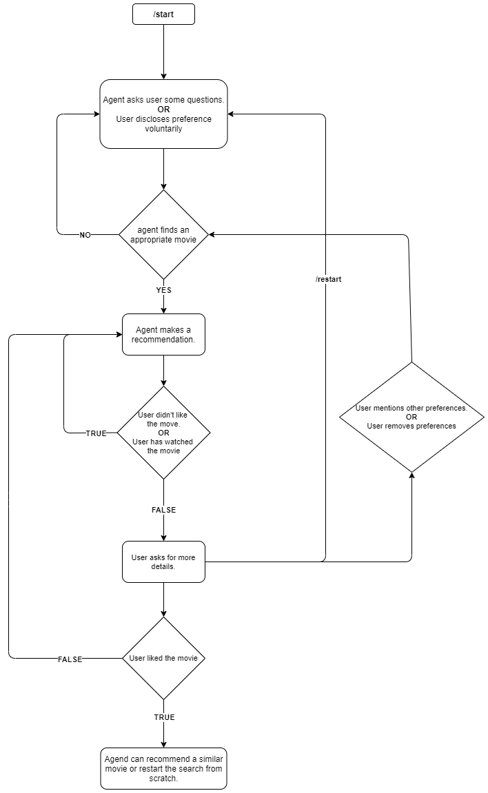

# Jarvis Version 1
This is the verion 1 of Jarvis. Jarvis is a movie recommendation system created for research purposes. Version 1 is based on hand-written rules and user-feedback will be used to improve this system.

## Instructions to interact with Jarvis
1. You can access the system at https://t.me/Jarvis_MRSv1_bot
2. To start the conversation, you can enter the following option:
 - /start
 - **Hi** or **Hello**
 - Ask any questions like *I want some ramance movies from the 90s*
3. For more details, refor to the [dialogue flow](#dialogue-flow) of Jarvis
4. As a heads-up, check the [list of genres](#genres) available in Jarvis v1
5. If agents asks for your preference, you have an option of not answering.
 - For example, if agent asks "Do you have any favourite director?", you can answer "It doesn't matter", "I don't care", "Anything" etc.
6. Kindly provide us with you valuable feedback at this link: https://forms.gle/WZpDcqKRxLZRSV6G8

### Dialogue Flow

### Genres
When the system asks for genres, one of the following options should be provided:
- "War",
- "Crime",
- "Family",
- "Western",
- "Biography",
- "Drama",
- "Adventure",
- "Fantasy",
- "Film-Noir",
- "Documentary",
- "Thriller",
- "Sport",
- "Mystery",
- "Comedy",
- "History",
- "Musical",
- "Short",
- "Horror",
- "Animation",
- "Sci-Fi",
- "Action",
- "Music",
- "Romance",
- "News"
